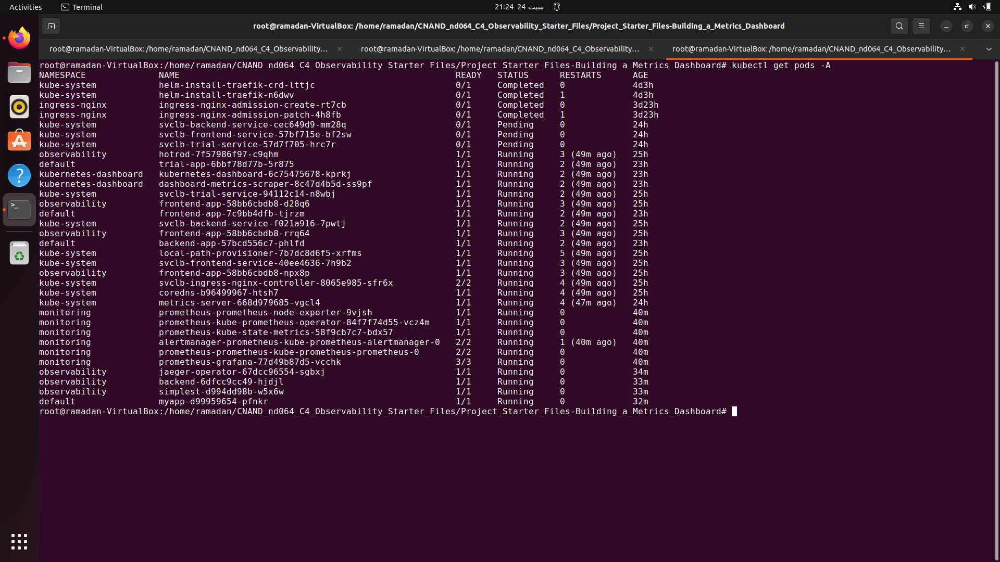
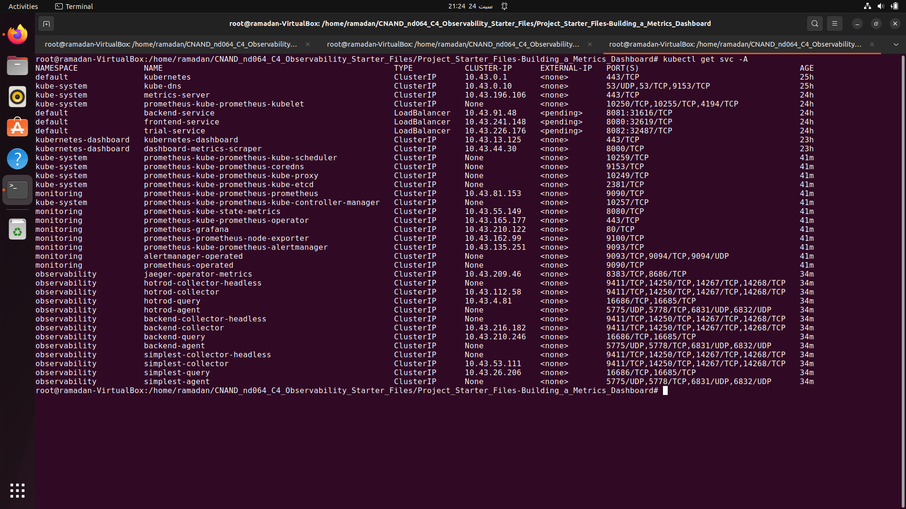
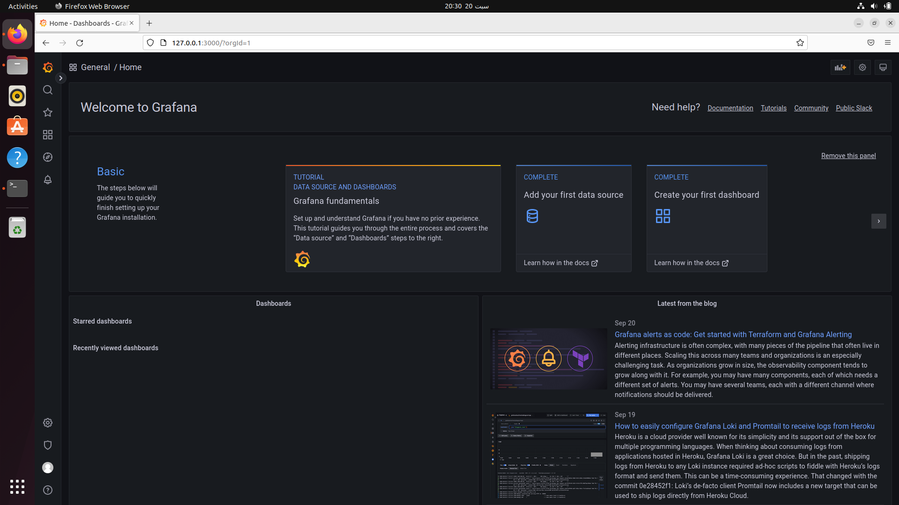
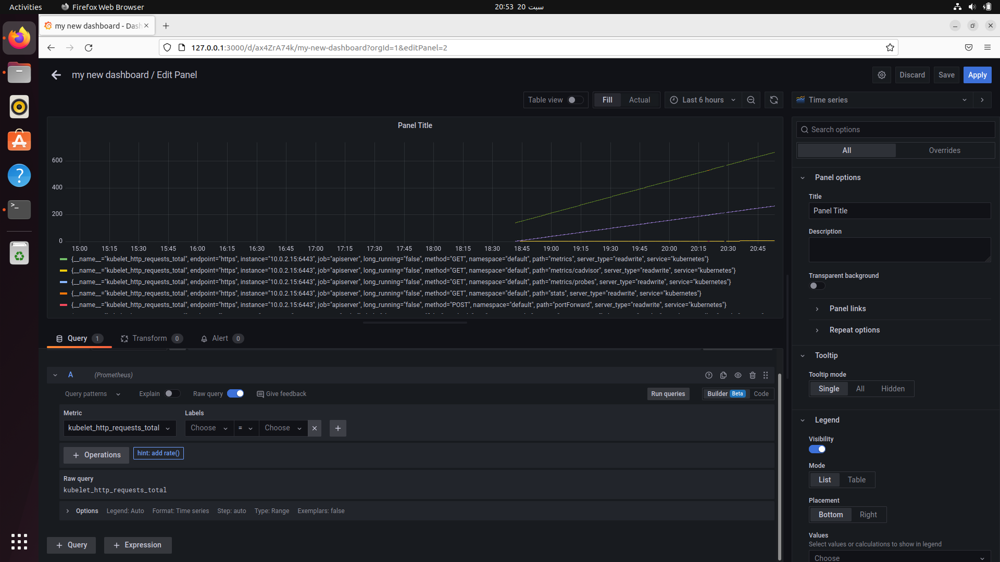
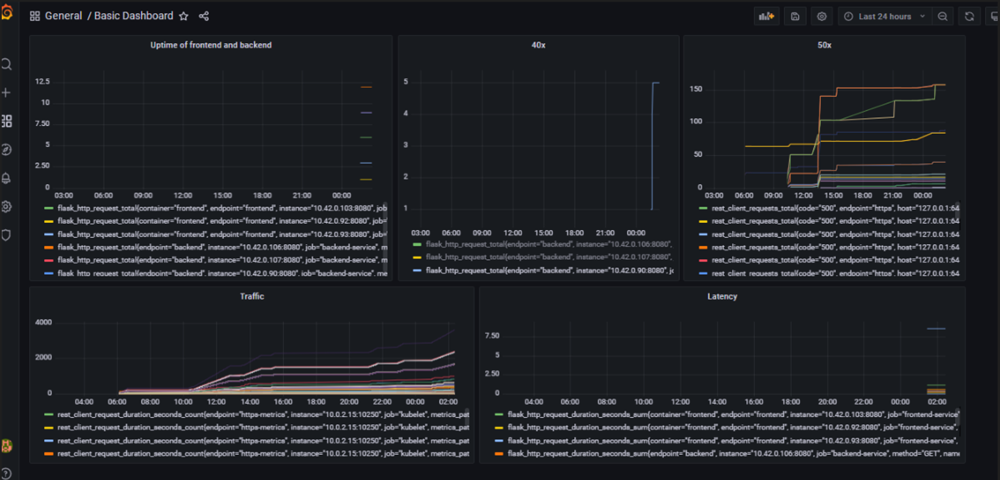
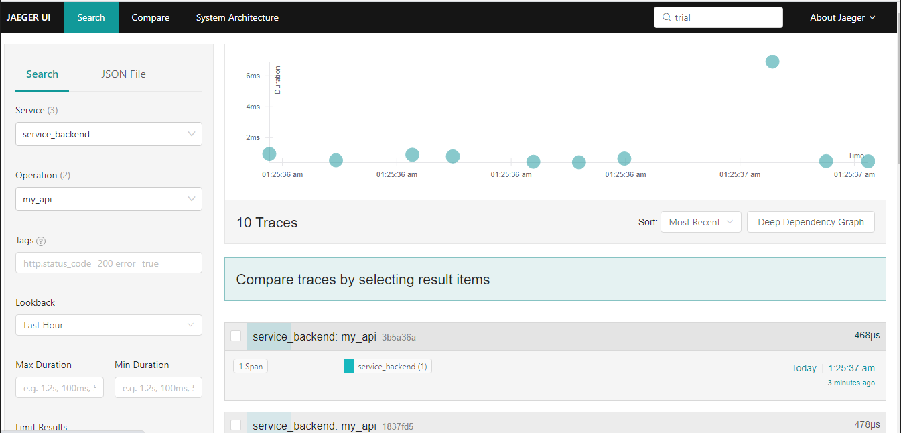
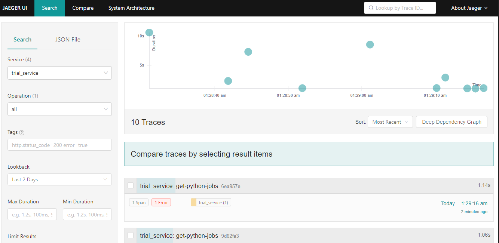
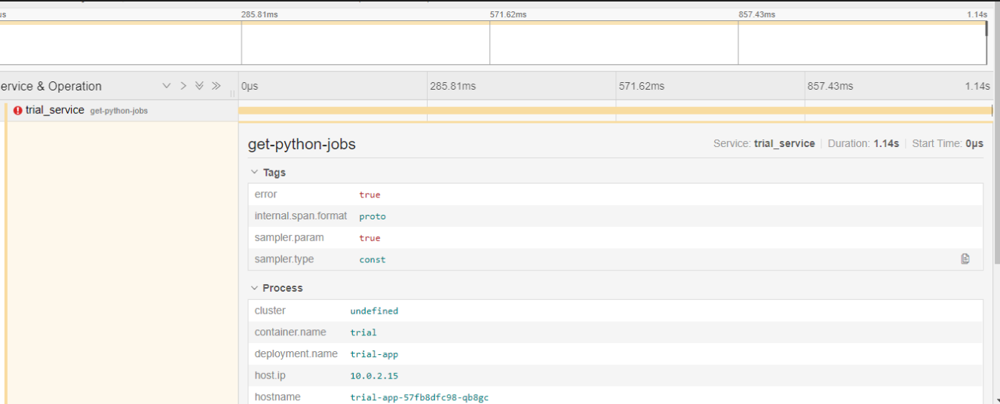
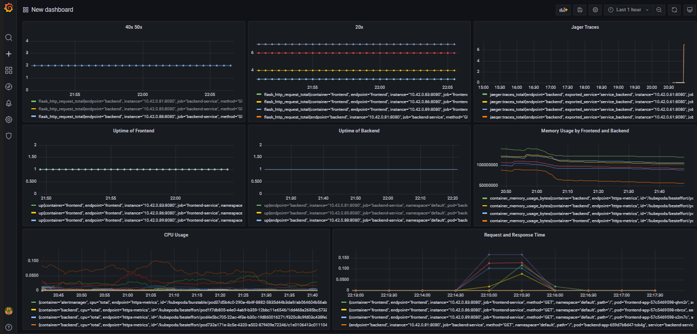

## Verify the monitoring installation

_Done:_ run `kubectl` command to show the running pods and services for all components. Take a screenshot of the output and include it here to verify the installation.
### All Pods

### All SVC

## Setup the Jaeger and Prometheus source

_Done:_ Expose Grafana to the internet and then setup Prometheus as a data source. Provide a screenshot of the home page after logging into Grafana.

### Welcome Grafana

## Create a Basic Dashboard

_Done:_ Create a dashboard in Grafana that shows Prometheus as a source. Take a screenshot and include it here.

## Describe SLO/SLI

_TODO:_ We want to create an SLO that guarantees that the app has a 99.95% uptime per month.

1. we should consider the response to the customer.
2. we should monitor the Traffic flow of the frontend and more specific to the Backend and Trial API serving the frontend.
3. Percentage of Success hits to Frontend, Backend & Trial should always be above 99.95% for the monthly duration.
4. we should consider utilization of th app such as CPU, Memory and Disk
5. we should monitor the Start Timings of the Pod along with the number of replicas.

## Creating SLI metrics.

_Done:_

1. Request time respond. 
    * Response time
2. How many failed requests .
    * Error rate
3. Hom many requests over a period of time.
    * Availability 
4. The utilization of the CPU and Memory by the service.
5. Uptime of the Fronted & Backend service.

## Create a Dashboard to measure our SLIs

_Done:_ Create a dashboard to measure the uptime of the frontend and backend services We will also want to measure to measure 40x and 50x errors. Create a dashboard that show these values over a 24 hour period and take a screenshot.

## Tracing our Flask App

## Report Error

_Done:_ Using the template below, write a trouble ticket for the developers, to explain the errors that you are seeing (400, 500, latency) and to let them know the file that is causing the issue also include a screenshot of the tracer span to demonstrate how we can user a tracer to locate errors easily.

TROUBLE TICKET

Name: Homepage can't be reach

Date: 9/24/2022

Subject: FrontEnd-service not reachable

Affected Area: FrontEnd-service & Ingress

Severity: ERROR

Description: It seems that FrontEnd-service has change it's port scheme and therefore Ingress is not able to reach service.

## Creating SLIs and SLOs

_Done:_ We want to create an SLO guaranteeing that our application has a 99.95% uptime per month. Name four SLIs that you would use to measure the success of this SLO.
* Uptime
* Latency
* Error rate
* Resource Usage

## Building KPIs for our plan

1. Uptime
    * BackEnd-service Up/Down
    * FrontEnd-service Up/Down
    * Kubernetes Uptime
2. Latency
    * Avg time of responses
    * Number of successful request second
3. Error rate
    * Rate of failed request per sec
    * Error codes for all services 500s & 400s
4. Resource Usage
    * Used memory
    * CPU Usage

## Final Dashboard

